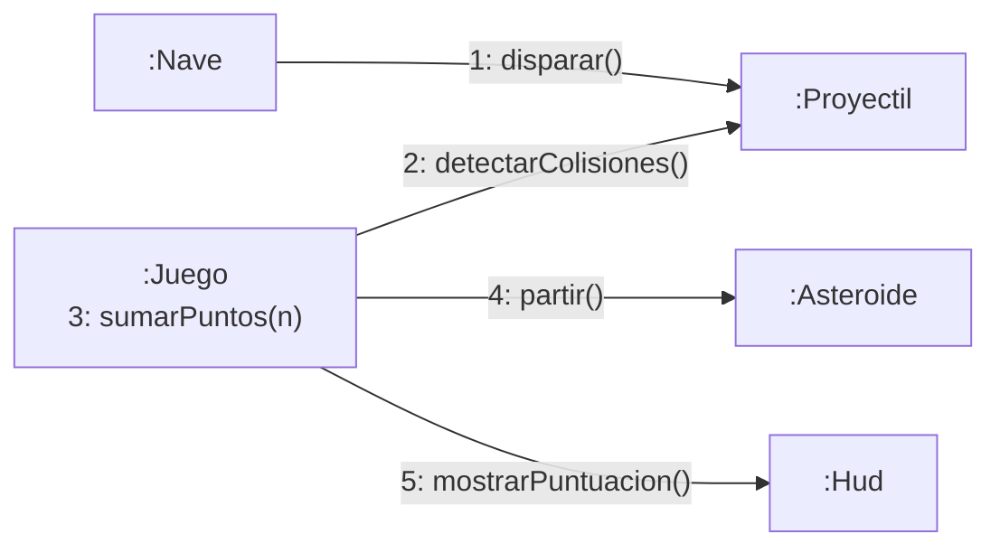

# Space Shooter – Diagrama de colaboración

```mermaid
flowchart LR
    N[":Nave"]
    J[":Juego<br/>3: sumarPuntos(n)"]
    P[":Proyectil"]
    A[":Asteroide"]
    H[":Hud"]

    N -- "1: disparar()" --> P
    J -- "2: detectarColisiones()" --> P
    J -- "4: partir()" --> A
    J -- "5: mostrarPuntuacion()" --> H
```
