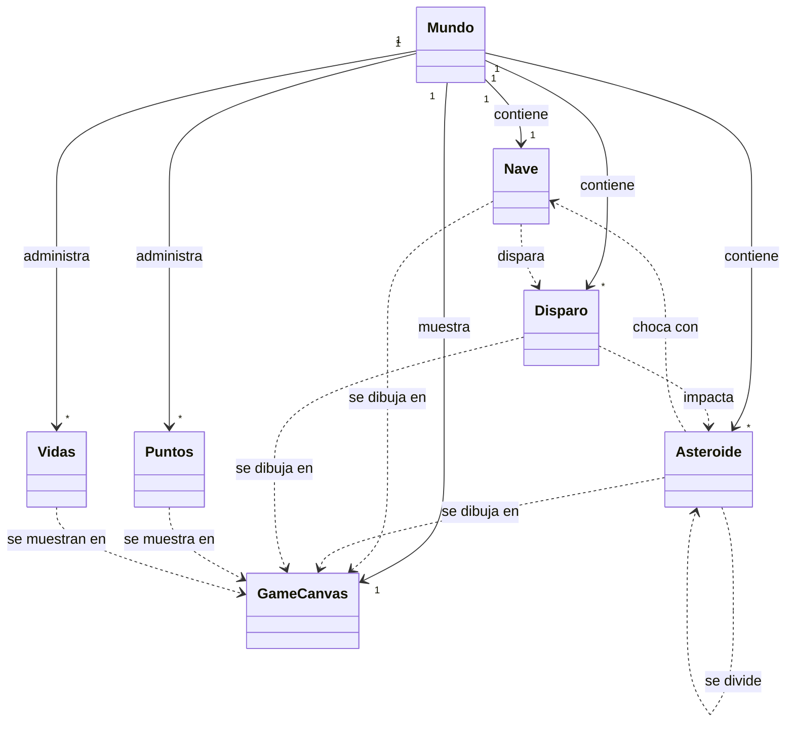

```mermaid
classDiagram
    class Mundo
    class Nave
    class Asteroide
    class Disparo
    class Puntos
    class Vidas
    class GameCanvas

    Mundo "1" --> "1" Nave : contiene
    Mundo "1" --> "*" Asteroide : contiene
    Mundo "1" --> "*" Disparo : contiene
    Mundo "1" --> "*" Puntos : administra
    Mundo "1" --> "*" Vidas : administra
    Mundo "1" --> "1" GameCanvas : muestra

    Nave ..> Disparo : dispara
    Disparo ..> Asteroide : impacta
    Asteroide ..> Asteroide : se divide
    Asteroide ..> Nave : choca con
    Nave ..> GameCanvas : se dibuja en
    Asteroide ..> GameCanvas : se dibuja en
    Disparo ..> GameCanvas : se dibuja en
    Puntos ..> GameCanvas : se muestra en
    Vidas ..> GameCanvas : se muestran en
```