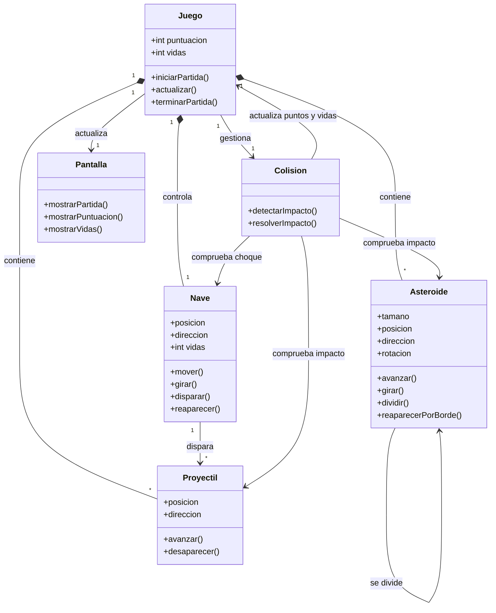

```mermaid
classDiagram
    class Juego {
        +int puntuacion
        +int vidas
        +iniciarPartida()
        +actualizar()
        +terminarPartida()
    }

    class Nave {
        +posicion
        +direccion
        +int vidas
        +mover()
        +girar()
        +disparar()
        +reaparecer()
    }

    class Asteroide {
        +tamano
        +posicion
        +direccion
        +rotacion
        +avanzar()
        +girar()
        +dividir()
        +reaparecerPorBorde()
    }

    class Proyectil {
        +posicion
        +direccion
        +avanzar()
        +desaparecer()
    }

    class Colision {
        +detectarImpacto()
        +resolverImpacto()
    }

    class Pantalla {
        +mostrarPartida()
        +mostrarPuntuacion()
        +mostrarVidas()
    }

    Juego "1" *-- "1" Nave : controla
    Juego "1" *-- "*" Asteroide : contiene
    Juego "1" *-- "*" Proyectil : contiene
    Juego "1" --> "1" Colision : gestiona
    Juego "1" --> "1" Pantalla : actualiza
    Nave "1" --> "*" Proyectil : dispara
    Colision --> Nave : comprueba choque
    Colision --> Asteroide : comprueba impacto
    Colision --> Proyectil : comprueba impacto
    Asteroide --> Asteroide : se divide
    Colision --> Juego : actualiza puntos y vidas
```
