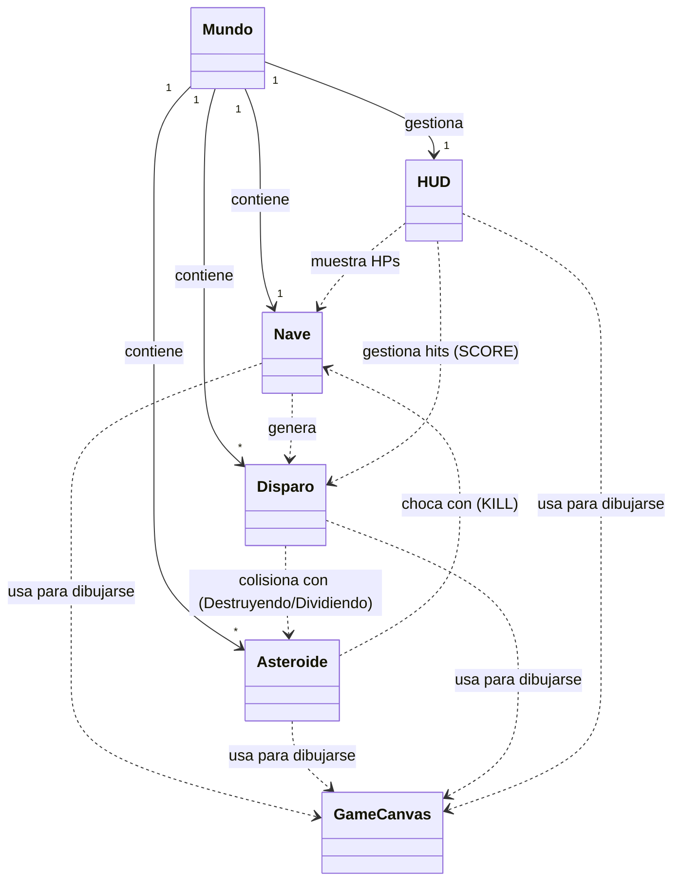

```mermaid
classDiagram
    Mundo "1" --> "1" Nave : contiene
    Mundo "1" --> "*" Asteroide : contiene
    Mundo "1" --> "*" Disparo : contiene
    Mundo "1" --> "1" HUD : gestiona

    Nave ..> Disparo : genera
    Nave ..> GameCanvas : usa para dibujarse
    Asteroide ..> GameCanvas : usa para dibujarse
    Disparo ..> GameCanvas : usa para dibujarse
    HUD ..> GameCanvas : usa para dibujarse

    Disparo ..> Asteroide : colisiona con (Destruyendo/Dividiendo)
    Asteroide ..> Nave : choca con (KILL)
    HUD ..> Disparo : gestiona hits (SCORE)
    HUD ..> Nave : muestra HPs
```